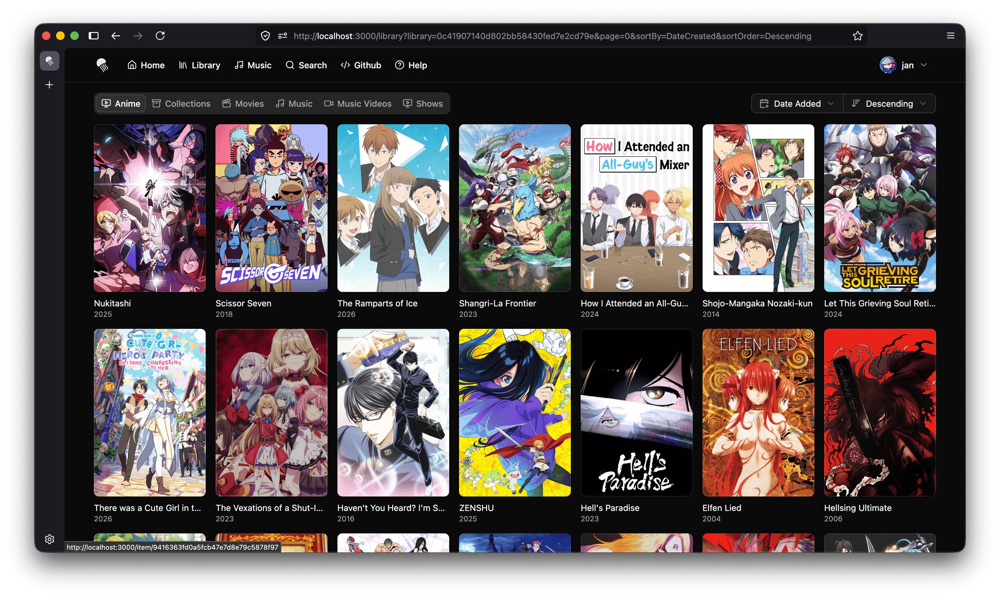

  
  <h1 align="center"><b>Pelagica</b></h1>

  
  
  
  
  

Pelagica is an alternative web frontend for <a href="https://jellyfin.org">Jellyfin</a> built using React. It aims to provide a fast, modern, and customizable user experience for browsing and watching your media library.

<!-- p align="center">A fast, modern web frontend for Jellyfin
 -->

## Table of Contents

- [Features](#features)
- [Demo](#demo)
- [Installation](#installation)
- [Discord](#discord)
- [Localization](#localization)
- [Development Setup](#development-setup)
- [Contributing](#contributing)
- [What does that name mean?](#what-does-that-name-mean)
- [Acknowledgements](#acknowledgements)
- [Disclaimer](#disclaimer)
- [License](#license)

## Features

- **Customizable Sections:** Tailor your homepage with sections like "Continue Watching", "Recently Added", or completely custom queries.
- **Media Bars:** Add custom media bars to feature specific content.
- **Search:** Quickly find media across your library from anywhere using `Cmd+K` / `Ctrl+K`.
- **Video Player:** Integrated video player for movies and TV shows.
- **Music Player:** A music player that allows you to listen to your music albums or playlists while browsing your library.
- **Responsive Design:** Works seamlessly on both desktop and mobile devices.
- **Theming:** Light and dark mode support as well as custom themes
- **Localization:** Supports multiple languages through [community contributions](#localization).

You can find a roadmap of planned features and improvements in the [GitHub Projects](https://github.com/users/KartoffelChipss/projects/7).

If you want to suggest new features or report bugs, please use the [GitHub Issues](https://github.com/KartoffelChipss/pelagica/issues) section.

### Integrated Services

- **Seerr:** Discover new movies and TV shows to watch, and request them without leaving Pelagica.
- **Streamystats:** Get your streamystats recommendations directly on your home page.
- **kefintweaks Watchlist:** View and manage your kefintweaks watchlist within Pelagica.

### Screenshots

<table>
  <tr>
    <td>
      
    </td>
    <td>
      
    </td>
  </tr>
  <tr>
    <td>
      
    </td>
    <td>
      
    </td>
  </tr>
</table>

> Screenshots may include media artwork used for demonstration purposes only.

## Demo

You can find a live demo of Pelagica at:

https://demo.pelagica.app/

The demo instance has the `jellyfin.streamyfin.app` server with a username preconfigured, so you just have to click "Login" to test it out. If your own Jellyfin server is publicly accessible, you can also use that by entering the server URL and your credentials.

For production use, you should self-host Pelagica using Docker or another method.

Thank you to [Streamyfin](https://streamyfin.app/) for providing a demo Jellyfin server for testing!

## Installation

Pelagica is distributed as a Docker image. See the [Installation](https://pelagica.app/docs/installation) and [Configuration](https://pelagica.app/docs/configuration) docs for setup instructions, and [Themes](https://pelagica.app/docs/themes) for applying custom themes.

## Discord

For discussions about Pelagica, join the [JellyfinCommunity](https://discord.gg/VKqprjh3Wr) and head to the `#pelagica` channel.

## Localization

Pelagica supports multiple languages through community contributions. See the [Translations](https://pelagica.app/docs/translations) docs for how to contribute.

## Development Setup

See the [Development Setup](https://pelagica.app/docs/development) docs for prerequisites and how to run the project locally.

## Contributing

See the [Contributing](https://pelagica.app/docs/contributing) docs for guidelines on reporting issues and submitting pull requests.

## What does that name mean?

You might be wondering about the name "Pelagica". Since I didn't want to call it the usual "\*fin" or "jelly\*" names, I looked for synonyms related to the sea. "Pelagic" refers to living in the deep ocean, which felt fitting for a Jellyfin frontend.

## Acknowledgements

Pelagica’s design was inspired by the [finetic](https://github.com/AyaanZaveri/finetic) Jellyfin frontend.  
No code was used; this project is an independent implementation.

## Disclaimer

This project is a third-party frontend for Jellyfin and is not affiliated with the Jellyfin project.

Jellyfin is a media server designed to organize and stream legally obtained media. This project does not provide, host, or encourage access to pirated content.

The movie posters and images shown in the examples are not owned by me and are only used for demonstration purposes. All rights belong to their respective owners.

## License

This project is licensed under the GNU General Public License v3.0 - see the [LICENSE](./LICENSE) file for details.
